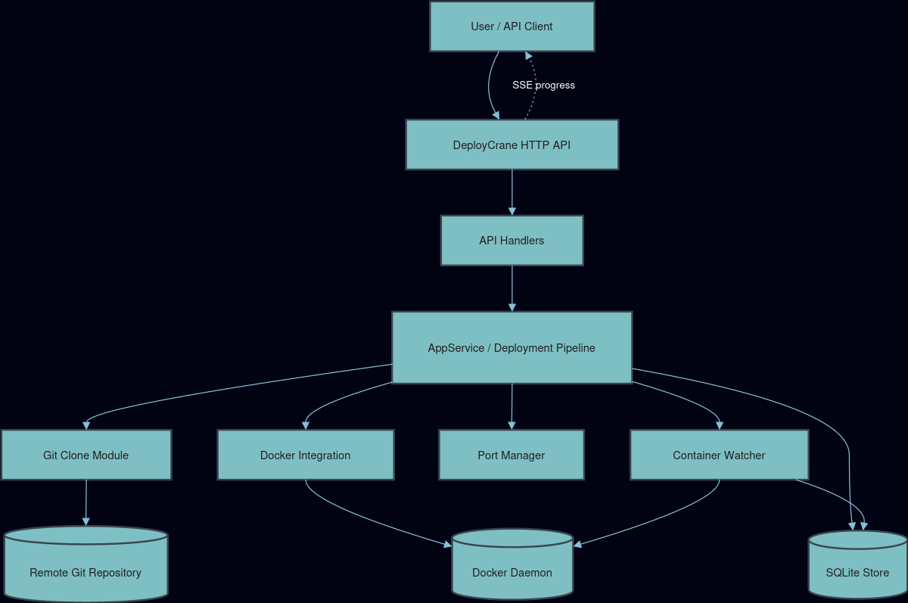
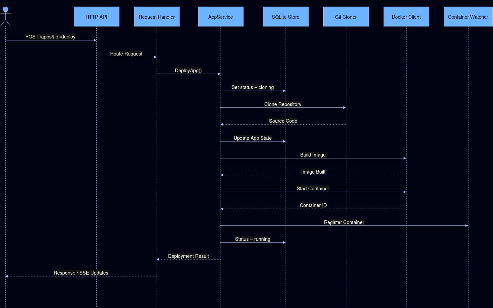

# DeployCrane
A minimal PaaS-inspired deployment system that builds and runs Git-based applications using Docker with realtime status tracking.

---
## System Architecture



#### DeployCrane is organized into four core layers:

* API Layer — REST request handling
* Service Layer — deployment orchestration
* Persistence Layer — SQLite-based state storage
* Infrastructure Layer — Git + Docker integration

---

## Deployment Workflow




### A deployment in DeployCrane follows this lifecycle:

Request → Clone Repo → Store Metadata → Build Image → Start Container → Monitor → Stream Status

---

## Built With

### DeployCrane leverages:

* Go — backend API and orchestration
* Docker — container runtime and deployment isolation
* SQLite — lightweight persistent state and app details tracking
* Server-Sent Events (SSE) — real-time deployment updates
* REST API — automation and integrations

--- 

## Setup

```bash
# Pull the latest image from DockerHub
docker pull parsasafavi/deploycrane:latest

# Run it with Docker socket
docker run -d \
  --name deploycrane \
  -p 8080:8080 \
  -v /var/run/docker.sock:/var/run/docker.sock \
  -v ./data:/app/data \
  -v ./clones:/app/clones \
  --restart unless-stopped \
  parsasafavi/deploycrane:latest
```

For a more detailed guide on how to setup and run your own deploycrane instance refer to [this link.](docs/docker-setup.md)


---

## Planned Improvements:

### Core enhancements

* Multi-user authentication
* Deployment rollback support
* Application logs

### Scaling & infrastructure

* Multi-host deployments
* Docker image-based deployment mode

### Observability

* Prometheus metrics integration
* Enhanced runtime monitoring

